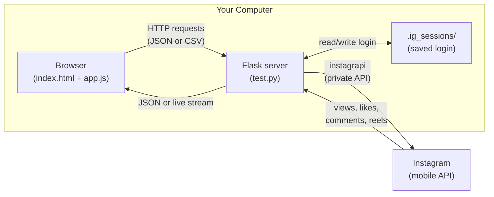
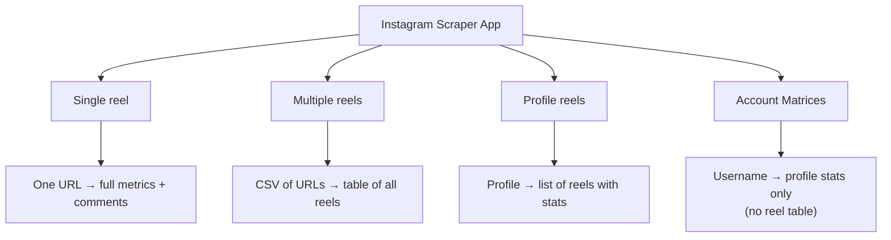
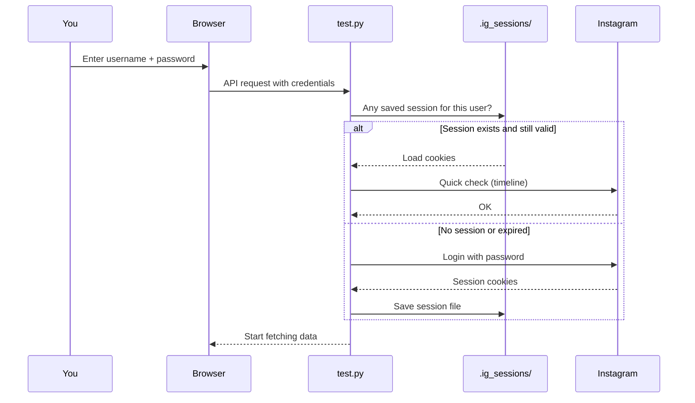
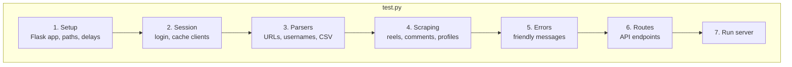
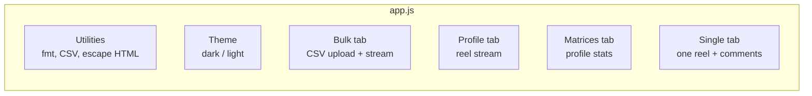
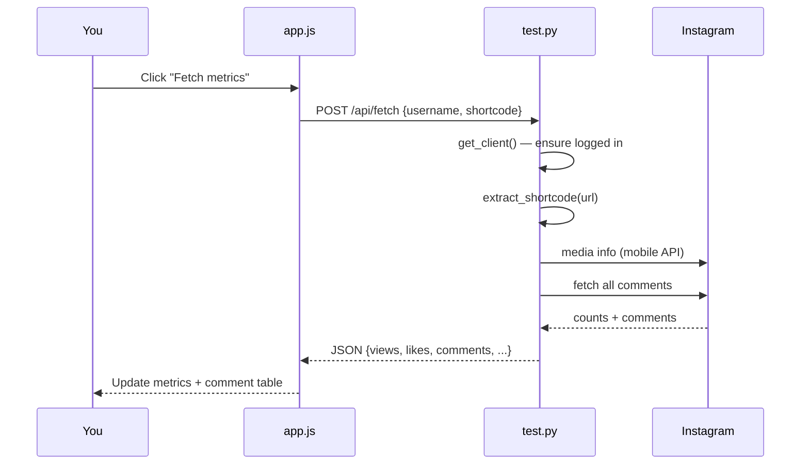

# Instagram Reel Metrics — Simple Guide

A **local web app** that runs on your computer. It logs into Instagram (like the mobile app) and fetches **reel numbers** — views, likes, comments, shares, saves, and more.

Everything stays on your machine. Nothing is sent to a cloud server.

> **Windows users:** See [SETUP.md](SETUP.md) for a full step-by-step install guide.

---

## Quick start (3 steps)

1. **Install** (one time):
   ```bash
   cd Multiple-reel-matrics
   python -m venv .venv
   source .venv/bin/activate   # Windows: .venv\Scripts\activate
   pip install flask instagrapi
   ```

2. **Run the server**:
   ```bash
   python test.py
   ```

3. **Open in browser**: [http://127.0.0.1:5000](http://127.0.0.1:5000)

   - Enter your **Instagram username**
   - Enter your **password** (only needed the first time)
   - Pick a tab and fetch data

---

## Folder structure (what each file does)

```
Multiple-reel-matrics/
│
├── test.py                 ← Backend (brain). Python + Flask + instagrapi
├── index.html              ← Frontend layout (tabs, forms, tables)
│
├── static/
│   ├── css/styles.css      ← Colors, layout, dark/light theme
│   └── js/app.js           ← Buttons, API calls, live progress bars
│
└── .ig_sessions/           ← Created automatically. Saves login so you
                              don't re-type your password every time
```

| File | Role in one sentence |
|------|----------------------|
| `test.py` | Talks to Instagram and returns JSON data to the browser |
| `index.html` | Shows the 4 tabs and all input fields / result tables |
| `app.js` | When you click a button, it calls the right API and updates the page |
| `styles.css` | Makes the app look clean (dark mode, tables, progress bars) |

---

## Big picture — how it works



**In plain English:**

1. You use the **website** in your browser.
2. The website asks the **Python server** (`test.py`) for data.
3. The server uses **instagrapi** to talk to Instagram (same API the phone app uses).
4. Results come back and show in tables on your screen.

---

## The 4 tabs (what each one is for)



### 1. Single reel

**Use when:** You have **one** reel or post link.

**Steps:**
1. Paste reel URL (or shortcode)
2. Click **Fetch metrics**
3. See views, likes, comments, shares, saves, reposts
4. Comments appear below (paginated)

**API used:** `POST /api/fetch`

---

### 2. Multiple reels (bulk CSV)

**Use when:** You have **many** reel URLs in a spreadsheet.

**Steps:**
1. Prepare a CSV with one URL per row (or a column named `url`)
2. Upload the file
3. Click **Process CSV**
4. Rows appear **one by one** as each reel finishes (progress bar)
5. Click **Load Comments** on any row if you need comment text
6. **Download CSV** when done

**API used:** `POST /api/bulk_fetch_stream` (live progress via Server-Sent Events)

---

### 3. Profile reels

**Use when:** You want **all reels from a profile** (with a limit).

**Steps:**
1. Enter `@username`, profile URL, or even a reel URL (owner is detected)
2. Set **Reels to fetch** (e.g. `20`, or `0` for all)
3. Click **Fetch profile reels**
4. Reels stream into the table as they load
5. Summary shows total views, likes, comments across loaded reels

**API used:** `POST /api/profile_reels_stream`

> Profile info (followers, bio, etc.) is **not** shown here — use **Account Matrices** for that.

---

### 4. Account Matrices

**Use when:** You only want **account-level stats**, not a reel list.

**Steps:**
1. Enter **username only** (e.g. `@username` — no profile URLs)
2. Click **Fetch account matrices**
3. See followers, posts, bio, verified status, **total reels**, oldest/latest reel dates, etc.

**API used:** `POST /api/profile_stats`

The server loads profile info, then **counts every reel** on the account to get accurate totals and dates. Large accounts may take longer.

---

## Login flow (first time vs later)



- **First visit:** Password required.
- **Next visits:** Leave password blank — session file is reused.
- Session files live in `.ig_sessions/instagrapi-<username>.json`.

---

## Backend structure (`test.py`)

The file is split into clear sections:



### Section 4 — important scraping functions

| Function | What it does |
|----------|----------------|
| `fetch_single_media()` | Gets **full** metrics for one reel (views, shares, saves…) |
| `fetch_media_comments()` | Gets all comments + replies for one reel |
| `media_to_dict()` | Turns one reel object into a simple JSON dict |
| `iter_user_clips_v1()` | Loads profile reels **page by page** |
| `fetch_profile_reel_summary()` | Counts all reels + oldest/newest dates (Account Matrices) |
| `process_reel_url()` | Handles one URL in bulk mode (success or error row) |

### Why instagrapi?

Instagram has two APIs:

| API | Used by | Counts |
|-----|---------|--------|
| Web / GraphQL | Browser, some tools | Often **lower** than the app shows |
| Mobile / private | Instagram app, **this project** | **Real** numbers |

This app forces the **mobile API** (`*_v1` methods) so numbers match what you see in the app.

---

## API endpoints (cheat sheet)

| Endpoint | Method | Used by tab | Purpose |
|----------|--------|-------------|---------|
| `/` | GET | All | Serves `index.html` |
| `/api/fetch` | POST | Single reel | One reel + all comments |
| `/api/reel_comments` | POST | Bulk / Profile | Load comments for one row on demand |
| `/api/bulk_fetch` | POST | — | Bulk without streaming (legacy) |
| `/api/bulk_fetch_stream` | POST | Multiple reels | Bulk with live progress |
| `/api/profile_reels` | POST | — | All profile reels at once (non-stream) |
| `/api/profile_reels_stream` | POST | Profile reels | Profile reels with live progress |
| `/api/profile_stats` | POST | Account Matrices | Profile + reel count/dates only |
| `/api/debug_node` | POST | Single reel (debug) | Raw Instagram fields for troubleshooting |

---

## Frontend structure (`app.js`)



**Live progress:** Bulk and Profile tabs use **Server-Sent Events (SSE)**. The server sends small updates (`start` → `progress`/`reel` → `complete`) and the table grows row by row.

---

## Example: what happens when you fetch one reel



---

## Data you get per reel

| Field | Meaning |
|-------|---------|
| Views | Play count |
| Likes | Like count |
| Comments | Comment count (reported by Instagram) |
| Shares | Reshare count |
| Saves | Save count |
| Reposts | Repost count (when available) |
| Date | When the reel was posted |
| Caption | Post text (trimmed in UI) |

Comments (when loaded): username, text, date, likes, reply or not.

---

## Tips & troubleshooting

| Problem | Try this |
|---------|----------|
| "Login required" | Enter password again — session expired |
| "Rate limited" | Wait a few minutes, fetch fewer reels |
| Wrong / low view counts | Restart server; this app uses mobile API on purpose |
| Account Matrices slow | Normal for accounts with many reels (counts all of them) |
| API 404 | Run `python test.py` and refresh the page |

**Environment variables (optional):**

- `IG_DELAY_RANGE=1,3` — delay between Instagram requests (default)
- `IG_FAST_DELAY_RANGE=0.4,1.0` — faster delays for bulk/profile
- `IG_PROFILE_PAGE_SIZE=50` — reels per page when loading a profile

---

## Summary

| Piece | Technology |
|-------|------------|
| Backend | Python, Flask, instagrapi |
| Frontend | HTML, CSS, JavaScript (no framework) |
| Login storage | JSON files in `.ig_sessions/` |
| Live updates | Server-Sent Events (SSE) |
| Runs on | `http://127.0.0.1:5000` (local only) |

**One line:** Browser UI → Flask (`test.py`) → Instagram mobile API → tables and CSV on your screen.
